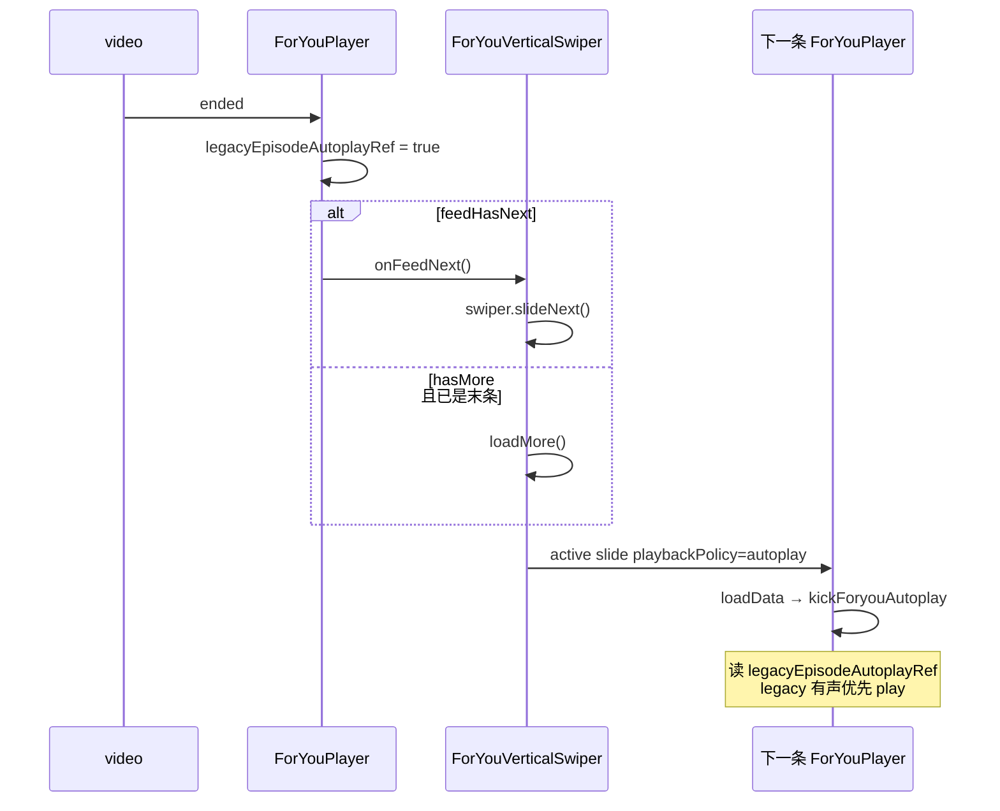
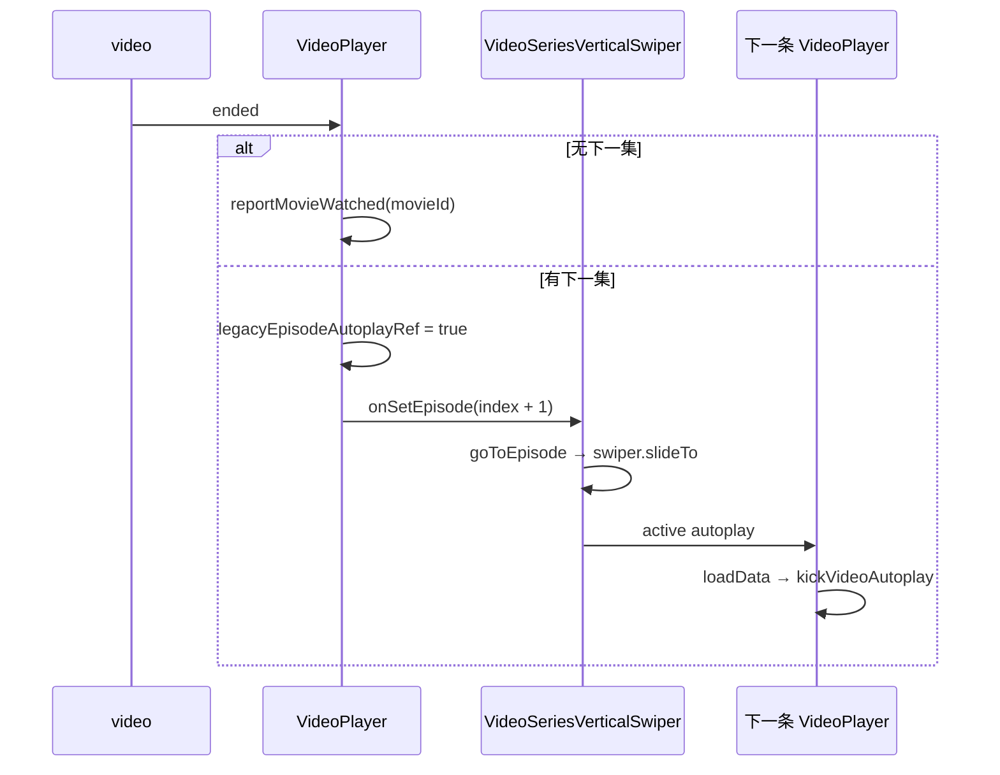

# slot-TV 自动连播下一集 — 对照参考（给 slot_old 实施读）

> **来源仓库**：`D:/JJ-TV/slot-TV`  
> **对照页面**：`/foryou` → `ForYouPage`；`/video/:id/:episode` → `VideoPage`（`Video.tsx` → `VideoSeriesVerticalSwiper`）  
> **目的**：slot_old 若要对齐 slot-TV 的「播完自动下一集」，先读本文，禁止凭印象实现。

---

## 1. 核心结论（必读）

| 问题 | slot-TV 实际行为 |
|------|-------------------|
| 是否「最后几秒提前切下一集」？ | **否**。没有 `timeupdate` 距结尾 N 秒切条逻辑。 |
| 自动连播触发点 | `<video>` 的 **`ended` 事件**（当前条播到片尾）。 |
| `END_MARGIN_SEC = 2`（ForYou） | 仅用于 **进度记忆**（距结尾 2 秒内视为看完、不存续播进度），**不触发切条**。 |
| 切条后如何自动 play | 切条前设 **`legacyEpisodeAutoplayRef = true`**，下一条 `loadData` → `kick*Autoplay` 读该 flag 走 legacy 有声优先 play。 |
| 列表如何换条 | **Swiper**：ForYou `slideNext()`；Video `slideTo(nextIndex)`。 |

slot_old 的 `DouyinFeedPlayer` / `useDouyinPlayerSlot` 若要对齐，应对齐 **ended → navigate/index + 连播 play 策略**，而不是「提前 2s 切条」（MD 里亦明确不对齐抖音提前切条）。

---

## 2. 文件地图（slot-TV）

### ForYou（`/foryou`）

| 角色 | 路径 |
|------|------|
| 页面入口 | `src/pages/user/ForYouPage/index.tsx` → `ForYouVerticalSwiper.tsx` |
| 列表壳 | `src/pages/user/ForYouPage/ForYouVerticalSwiper.tsx` |
| 播放器 | `src/pages/user/ForYouPage/ForYouPlayer.tsx` |
| 连播起播 | `src/pages/user/ForYouPage/foryouPlaybackKick.ts`（`kickForyouAutoplay`） |
| 进度记忆 | `src/pages/user/ForYouPage/foryouFeedProgress.ts`（`END_MARGIN_SEC = 2`） |

### Video（`/video/:id/:episode`）

| 角色 | 路径 |
|------|------|
| 路由入口 | `src/pages/user/Video.tsx` → `VideoPage/VideoSeriesVerticalSwiper.tsx` |
| 列表壳 | `src/pages/user/VideoPage/VideoSeriesVerticalSwiper.tsx` |
| 播放器 | `src/pages/user/VideoPage/VideoPlayer.tsx` |
| 连播起播 | `src/pages/user/VideoPage/videoPlaybackKick.ts`（`kickVideoAutoplay`） |
| 旧竖滑实现（路由未用） | `VideoPage/VideoVerticalSwiper.tsx` |

---

## 3. ForYou 自动下一集 — 完整链路



### 3.1 触发：`ForYouPlayer` — `videoEnded`

文件：`ForYouPage/ForYouPlayer.tsx`（约 L1578–1589）

```ts
const videoEnded = () => {
    setPlaying(false);
    if (isForYouFeed) {
        if (feedHasNext) {
            legacyEpisodeAutoplayRef.current = true;
            onFeedNext?.();
        }
        return;
    }
    legacyEpisodeAutoplayRef.current = true;
    onSetEpisode(props.index + 1);
};
```

- Feed 模式：`feedHasNext` 为真才连播。
- `feedHasNext` 由壳层传入：`activeIndex < list.length - 1 || hasMore`。

### 3.2 壳层切条：`handleFeedNext`

文件：`ForYouPage/ForYouVerticalSwiper.tsx`（约 L314–326）

```ts
if (activeIndex < list.length - 1) {
    swiper.slideNext();
    return;
}
if (hasMore) {
    void loadMore();
}
```

### 3.3 Swiper 换 active

`onSlideChangeStart`：更新 `activeIndex`、保存上条进度、abort 离开条 media。  
H5 额外 `markH5SwipeAutoplayIntent()` 再设 `legacyEpisodeAutoplayRef`；PC 连播主要靠 `videoEnded` 里已设的 ref。

### 3.4 下一条起播：`kickForyouAutoplay`

文件：`ForYouPage/foryouPlaybackKick.ts`（约 L66–116）

```ts
const useLegacyEpisodePlayback = rt.legacyEpisodeAutoplayRef.current;
rt.legacyEpisodeAutoplayRef.current = false;

if (useLegacyEpisodePlayback) {
    // preferSoundAutoplay → 有声 play，失败再静音兜底
    scheduleWhenBuffered(runLegacyPlay);
    return;
}
```

### 3.5 手动「下一集」按钮

`handleJumpNextEpisode`：同样 `legacyEpisodeAutoplayRef = true` + `onFeedNext()`，与 `ended` 同路径。

### 3.6 `timeupdate` 做什么（不切条）

- 主 effect：进度条 + 字幕 cue（`videoTimeUpdate`）。
- ForYou 专用 effect：节流上报 `onFeedPlaybackProgress` → `setForyouFeedProgressSec`（续播记忆）。

---

## 4. Video 自动下一集 — 完整链路



### 4.1 触发：`VideoPlayer` — `videoEnded`

文件：`VideoPage/VideoPlayer.tsx`（约 L1364–1372）

```ts
const videoEnded = () => {
    setPlaying(false);
    if (!hasNextEpisode()) {
        reportMovieWatched(data.info.id);
        return;
    }
    legacyEpisodeAutoplayRef.current = true;
    onSetEpisode(props.index + 1);
};
```

### 4.2 壳层切条：`goToEpisode`

文件：`VideoPage/VideoSeriesVerticalSwiper.tsx`（约 L194–221）

- `legacyEpisodeAutoplayRef.current = true`
- `setActiveIndex(idx)` + `syncNavigateForIndex`（URL replace）
- `swiperRef.current?.slideTo(idx, animate ? SWIPER_SLIDE_SPEED_MS : 0)`

`handleSetEpisode(index)` 即 `goToEpisode(index)` 的包装。

### 4.3 下一条起播：`kickVideoAutoplay`

文件：`VideoPage/videoPlaybackKick.ts`（约 L86–143）

与 ForYou 对称：读 `legacyEpisodeAutoplayRef` → legacy 有声优先 play → 清 flag。

PC 上 `preferSoundAutoplay` 在 legacy 路径下更容易保持有声。

---

## 5. `legacyEpisodeAutoplayRef` 语义

| 何时置 `true` | 含义 |
|---------------|------|
| `video ended` 自动连播 | 下一条应走连播 play，跳过冷启动静音策略 |
| 用户点「上一集/下一集」 | 同上 |
| H5 竖滑切条（ForYou / Video） | 在用户手势链内置位，iOS 有声 play |
| Video `goToEpisode` | 程序化切集 |

| 何时读并清 `false` | 位置 |
|--------------------|------|
| 下一条 `kickForyouAutoplay` / `kickVideoAutoplay` 开头 | 读一次后立即 `= false` |

**slot_old 等价物**：需要在「ended / 用户切集 / scroll 切条」时标记连播意图，并在 `scheduleActivePlay` 或壳层 policy 里区分「冷启动首条」vs「连播切条」。

---

## 6. 会阻止自动连播的条件

| 条件 | 行为 |
|------|------|
| URL `?auto_play=0` | `kick*Autoplay` 直接 return |
| 当前集 `episode.lock` | 不挂片源 / 不 play |
| ForYou 无下一条且 `hasMore=false` | `videoEnded` 不调用 `onFeedNext` |
| Video 已是最后一集 | 只 `reportMovieWatched`，不切集 |

---

## 7. slot_old 实施对照清单

实施 for-demo / v-demo 自动连播时，建议按 slot-TV 对齐：

- [ ] **触发**：片尾 `ended`（`DouyinFeedPlayer.onVideoEnded` / slot 层 `bindEndedListener`），不要在 `timeupdate` 里提前 N 秒切条，除非产品明确要求且单独 AUDIT。
- [ ] **切 index**：壳层 `onIndexChange` / scroll / navigate（ForYou 等价 `slideNext`；Video 等价 `goToEpisode`）。
- [ ] **连播 play**：切条前设连播 flag（等价 `legacyEpisodeAutoplayRef`），下一条 `scheduleActivePlay` 走有声/legacy 策略。
- [ ] **末条 ForYou**：无 `hasMore` 时不切；有 `hasMore` 时走 loadMore（slot-TV 是 API 拉取，不是播放器内假 slide）。
- [ ] **末条 Video**：上报 watched（若 slot_old 有对应 API）并停止。

**不必从 slot-TV 照搬**：

- Swiper 组件本身（slot_old 用 `DouyinFeedPlayer` scroll-snap + 多 slot 即可）。
- `foryouFeedProgress` 的 `END_MARGIN_SEC` 除非要做 Feed 续播记忆，与自动连播无关。

---

## 8. slot_old 现有相关代码（快速索引）

| 能力 | 文件 |
|------|------|
| 片尾 ended 监听 | `douyin-feed-player/player/useDouyinPlayerSlot.ts` — `bindEndedListener` |
| ended 回调上抛 | `DouyinFeedPlayer.tsx` — `onVideoEnded(index)` |
| 切条调度 | `DouyinFeedPlayer.tsx` — `navigate` / `syncActiveIndex` |
| 起播 | `douyin-feed-player/player/createXgPlayer.ts` — `scheduleActivePlay` |
| 冷启动蒙层 policy | `ForDemo/forDemoAutoplayPolicy.ts`、`stores/forDemoColdUnmute.ts` |
| 播放架构总览 | `douyin-feed-player/PLAYBACK-ARCHITECTURE.md` |

---

## 9. 修订记录

| 日期 | 说明 |
|------|------|
| 2026-06-12 | 初版：对照 slot-TV ForYouPage + VideoPage 梳理 ended 连播链路 |
| 2026-06-12 | slot_old：`markChainAutoplayFromEnded` + iOS NotAllowedError 静音重试（`createXgPlayer.ts`） |
